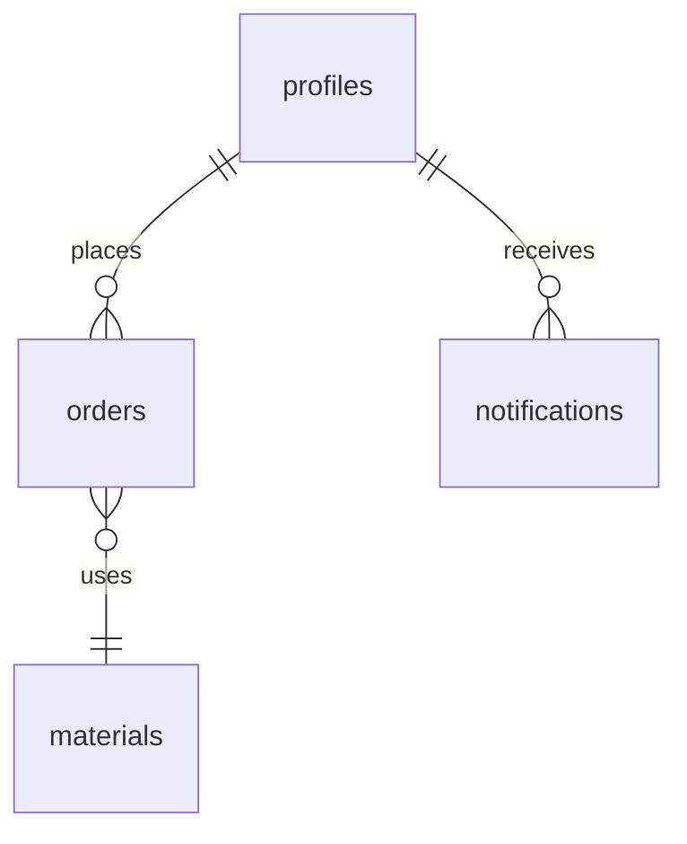

# Database Schema

## Tables

### profiles
User profiles and authentication data.

```sql
create table public.profiles (
  id uuid references auth.users primary key,
  created_at timestamp with time zone default timezone('utc'::text, now()) not null,
  updated_at timestamp with time zone,
  display_name text,
  role text check (role in ('admin', 'customer')) default 'customer' not null,
  avatar_url text default 'https://github.com/shadcn.png'
);

-- Enable RLS
alter table public.profiles enable row level security;

-- Policies
create policy "Public profiles are viewable by everyone"
  on profiles for select
  using (true);

create policy "Users can update own profile"
  on profiles for update
  using (auth.uid() = id);
```

### materials
Available materials and their prices.

```sql
create table public.materials (
  id uuid default gen_random_uuid() primary key,
  created_at timestamp with time zone default timezone('utc'::text, now()) not null,
  updated_at timestamp with time zone,
  name text not null unique,
  description text,
  price_per_piece decimal(10,2) not null,
  image_url text
);

-- Enable RLS
alter table public.materials enable row level security;

-- Policies
create policy "Everyone can view materials"
  on materials for select
  using (true);

create policy "Admin can modify materials"
  on materials for all
  using (
    auth.uid() in (
      select id from profiles
      where role = 'admin'
    )
  );
```

### orders
Customer orders with their details.

```sql
create table public.orders (
  id uuid default gen_random_uuid() primary key,
  created_at timestamp with time zone default timezone('utc'::text, now()) not null,
  updated_at timestamp with time zone,
  customer_id uuid references public.profiles(id) not null,
  status text check (status in ('menunggu_pembayaran', 'diproses', 'produksi', 'selesai')) default 'menunggu_pembayaran' not null,
  quantity integer check (quantity >= 24) not null,
  design_url text not null,
  design_description text,
  material text not null,
  total_amount decimal(10,2) not null,
  unique_code integer not null,
  estimated_completion_days integer,
  is_paid boolean default false
);

-- Enable RLS
alter table public.orders enable row level security;

-- Policies
create policy "Customers can view own orders"
  on orders for select
  using (auth.uid() = customer_id);

create policy "Customers can create own orders"
  on orders for insert
  with check (auth.uid() = customer_id);

create policy "Customers can update own orders"
  on orders for update
  using (auth.uid() = customer_id);

create policy "Admin can view all orders"
  on orders for select
  using (
    auth.uid() in (
      select id from profiles
      where role = 'admin'
    )
  );

create policy "Admin can update orders"
  on orders for update
  using (
    auth.uid() in (
      select id from profiles
      where role = 'admin'
    )
  );

create policy "Admins can update any order"
  on orders for update
  using (
    exists (
      select 1 from profiles
      where id = auth.uid()
      and role = 'admin'
    )
  );
```

### notifications
System notifications for users.

```sql
create table public.notifications (
  id uuid default gen_random_uuid() primary key,
  created_at timestamp with time zone default timezone('utc'::text, now()) not null,
  user_id uuid references public.profiles(id) not null,
  title text not null,
  message text not null,
  is_read boolean default false,
  type text check (type in ('order_status', 'payment', 'system')) not null
);

-- Enable RLS
alter table public.notifications enable row level security;

-- Policies
create policy "Users can view own notifications"
  on notifications for select
  using (auth.uid() = user_id);

create policy "Users can update own notifications"
  on notifications for update
  using (auth.uid() = user_id);
```

## Indexes

```sql
-- Performance indexes
create index orders_customer_id_idx on public.orders(customer_id);
create index orders_status_idx on public.orders(status);
create index notifications_user_id_idx on public.notifications(user_id);
```

## Triggers and Functions

### User Profile Creation Trigger

```sql
create or replace function public.handle_new_user()
returns trigger
language plpgsql
security definer set search_path = public
as $$
declare
  email_prefix text;
begin
  -- Extract everything before @ in email
  email_prefix := split_part(new.email, '@', 1);
  
  insert into public.profiles (
    id,
    display_name,
    avatar_url,
    role
  )
  values (
    new.id,
    email_prefix,
    'https://github.com/shadcn.png',
    'customer'
  );
  return new;
end;
$$;

-- Create trigger
create trigger on_auth_user_created
  after insert on auth.users
  for each row execute procedure public.handle_new_user();
```

## Storage

### Designs Bucket

Storage policies for user-uploaded design files:

```sql
-- Allow any authenticated user to upload files to their own folder
create policy "Users can upload design files"
  on storage.objects for insert
  with check (
    bucket_id = 'designs' AND
    auth.role() = 'authenticated' AND
    (storage.foldername(name))[1] = auth.uid()::text
  );

-- Allow users to view their own design files
create policy "Users can view own designs"
  on storage.objects for select
  using (
    bucket_id = 'designs' AND
    auth.role() = 'authenticated' AND
    (
      -- Users can view their own designs
      (storage.foldername(name))[1] = auth.uid()::text
      OR
      -- Admin can view all designs
      exists (
        select 1 from profiles
        where id = auth.uid()
        and role = 'admin'
      )
    )
  );
```

## Relationships



## Sample Data

### Materials

```sql
insert into public.materials (name, description, price_per_piece)
values 
  ('Cotton Combed 24s', 'High quality cotton combed fabric, perfect for t-shirts', 55000),
  ('Cotton Combed 30s', 'Soft and breathable cotton combed fabric, ideal for t-shirts', 50000),
  ('Denim', 'Heavy-duty denim fabric, ideal for jackets and jeans', 75000),
  ('Rayon', 'Lightweight and breathable rayon fabric', 65000),
  ('Linen', 'Premium linen fabric with natural texture', 85000);
```

## Notes

1. **Row Level Security (RLS)**: All tables have RLS enabled for security
2. **Authentication**: JWT authentication via Supabase Auth
3. **Timestamps**: All timestamps are in UTC timezone
4. **Primary Keys**: UUIDs are used as primary keys with `gen_random_uuid()`
5. **Foreign Keys**: Maintain referential integrity between tables
6. **Triggers**: Automatic user profile creation on new user registration
7. **Storage**: File uploads are scoped to user directories with proper access controls
8. **Pricing**: Material prices are stored as `decimal(10,2)` but converted to integer in some policies
9. **Order Status**: Four-stage workflow from payment to completion
10. **Minimum Order**: 24-piece minimum order quantity enforced at database level