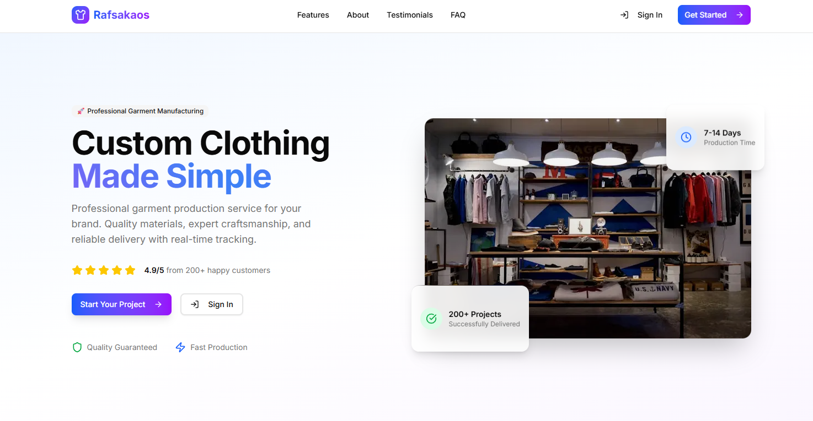

# Rafsakaos Konveksi Management System



A modern multilingual web application for managing custom clothing production orders built with Next.js 15 and Supabase.

## Features

### Landing Page

- 🌟 Modern responsive design with animated components
- 🌍 **Multilingual support** (Indonesian/English) with language switcher
- 📊 Customer testimonials with auto-sliding carousel
- 💫 Animated gradient text and floating cards
- 📱 Mobile-first responsive design
- ❓ Interactive FAQ section

### Customer Features

- 📱 **Interactive Dashboard** with personalized statistics
- 🧮 **Material Catalog** with price calculation
- 📝 **Order Management** - Create, track, and manage orders
- 💳 **Payment Integration** with unique order codes
- 📊 **Analytics Dashboard** - Order history, spending charts, completion rates
- 🔔 **Real-time notifications** for order status updates
- 👤 **Profile Management** with role-based access
- 📈 **Progress Tracking** with animated counters and progress rings

### Admin Features

- 📊 **Advanced Dashboard** with revenue analytics and order statistics
- 📦 **Order Management** - Full order lifecycle management
- 👥 **Customer Management** with role-based permissions
- 🧵 **Material Catalog Management** - Add, edit, delete materials
- 📈 **Real-time Analytics** with mini charts and animated counters
- 🏭 **Production Management** with status tracking
- 📨 **Notification System** for order updates
- 📁 **Archive Management** for completed orders
- 📋 **Inventory Management** with stock tracking

### Authentication & Security

- 🔐 **Secure Authentication** with email/password
- 🛡️ **Role-based Access Control** (Admin/Customer)
- 🔒 **Protected Routes** with middleware authentication
- 🚫 **Unauthorized Access Prevention**
- 📧 **Email Verification** and password reset
- 🛡️ **Temporary Email Protection** - Blacklist system preventing temporary/disposable email registration

## Tech Stack

- **Frontend:** Next.js 15, TypeScript, TailwindCSS, shadcn/ui
- **Backend:** Supabase (PostgreSQL, Auth, Storage, Real-time)
- **State Management:** React Hooks, Custom Context
- **Internationalization:** Custom i18n implementation with translations
- **Form Handling:** React Hook Form, Zod validation
- **Styling:** TailwindCSS with custom components
- **UI Components:** shadcn/ui with custom animated components
- **Charts:** Custom mini charts and progress components
- **Notifications:** Sonner toast notifications

## Getting Started

### Prerequisites

- Node.js 18+
- npm/pnpm/yarn
- Supabase account and project

### Environment Setup

1. Clone the repository

```bash
git clone https://github.com/raffimh/Konveksi-RafsakaosV2.git
cd Konveksi-RafsakaosV2
```

2. Install dependencies

```bash
npm install
# or
pnpm install
```

3. Create `.env.local` with your Supabase credentials

```env
NEXT_PUBLIC_SUPABASE_URL=your_supabase_project_url
NEXT_PUBLIC_SUPABASE_ANON_KEY=your_supabase_anon_key
```

4. Initialize Supabase database

```bash
# Run Supabase migration files
supabase db reset
```

5. Run the development server

```bash
npm run dev
# or
pnpm dev
```

### Supabase Setup

1. Create tables using SQL from `supabase/schema.sql`
2. Apply RLS policies from `supabase/policies.sql`
3. Set up triggers from `supabase/triggers.sql`
4. Set up storage from `supabase/storage.sql and storage-update.sql`
5. Configure storage buckets for design files

## Documentation

- [API Reference](API_REFERENCE.md) - API endpoints and types
- [Database Schema](DATABASE_SCHEMA.md) - Database structure
- [Setup Guide](SETUP_GUIDE.md) - Detailed setup instructions
- [Production Setup](PRODUCTION_SETUP.md) - Production deployment guide

## Key Features Implementation

### Internationalization (i18n)

- **Bilingual Support:** Indonesian and English translations
- **Dynamic Language Switching:** Real-time language toggle
- **Comprehensive Translation Coverage:** All UI elements, notifications, and content
- **Language Context Provider:** Custom hook implementation
- **Persistent Language Selection:** Language preference storage

### Real-time Notifications

- Order status changes trigger notifications
- Supabase real-time subscriptions
- Toast notifications with Sonner
- Dashboard live updates

### Advanced UI Components

- **Animated Counters:** Smooth number animations for statistics
- **Progress Rings:** Circular progress indicators
- **Mini Charts:** Inline data visualization
- **Floating Cards:** Animated floating elements
- **Gradient Text:** Animated gradient text effects
- **Customer Slider:** Auto-sliding testimonial carousel

### Authentication & Authorization

- **Supabase Auth:** Email/password authentication
- **Middleware Protection:** Route-level access control
- **Role-based Routing:** Admin vs Customer dashboards
- **Session Management:** Automatic session updates
- **Unauthorized Access Handling:** Dedicated error pages

### Dashboard Analytics

- **Customer Dashboard:** Personal order statistics, spending analysis
- **Admin Dashboard:** Revenue tracking, order management, customer analytics
- **Real-time Data:** Live updates with Supabase subscriptions
- **Interactive Charts:** Mini charts for trend visualization
- **Animated Statistics:** Engaging counter animations

### Material Management

- Material catalog with pricing
- Image upload and storage
- Stock management
- Category organization
- Admin material CRUD operations

### Order Management

- **Full Lifecycle Tracking:** From creation to completion
- **Status Management:** Pending payment, processing, production, completed
- **Payment Integration:** Unique order codes for payment tracking
- **Design Upload:** Customer design file handling
- **Order History:** Complete order tracking for customers
- **Admin Order Control:** Full order management for administrators

## Project Structure

```
src/
├── app/                          # Next.js App Router
│   ├── (dashboard)/admin/        # Admin dashboard routes
│   │   ├── customers/            # Customer management
│   │   ├── inventory/            # Inventory management
│   │   ├── materials/            # Material management
│   │   ├── orders/              # Order management
│   │   ├── production/          # Production tracking
│   │   └── reports/             # Analytics & reports
│   ├── auth/                    # Authentication pages
│   ├── customer/                # Customer dashboard routes
│   │   ├── materials/           # Material browsing
│   │   └── orders/              # Order management
│   ├── profile/                 # User profile management
│   └── unauthorized/            # Access denied page
├── components/                  # Reusable components
│   ├── auth/                    # Authentication components
│   ├── layouts/                 # Layout components
│   ├── notifications/           # Notification components
│   ├── orders/                  # Order-related components
│   └── ui/                      # UI components
├── lib/                         # Utilities and configurations
│   ├── hooks/                   # Custom React hooks
│   ├── i18n/                    # Internationalization
│   ├── supabase/                # Supabase configuration
│   ├── types/                   # TypeScript type definitions
│   └── validations/             # Zod schemas
└── middleware.ts                # Authentication middleware
```

## Contributing

1. Fork the repository
2. Create your feature branch (`git checkout -b feature/amazing-feature`)
3. Commit your changes (`git commit -m 'Add some amazing feature'`)
4. Push to the branch (`git push origin feature/amazing-feature`)
5. Open a Pull Request

## License

This project is licensed under the MIT License - see the [LICENSE](LICENSE) file for details.

## Acknowledgments

- [Next.js](https://nextjs.org/) - React framework
- [Supabase](https://supabase.com/) - Backend-as-a-Service
- [shadcn/ui](https://ui.shadcn.com/) - UI component library
- [TailwindCSS](https://tailwindcss.com/) - CSS framework
- [Lucide Icons](https://lucide.dev/) - Icon library
- [Sonner](https://sonner.emilkowal.ski/) - Toast notifications
